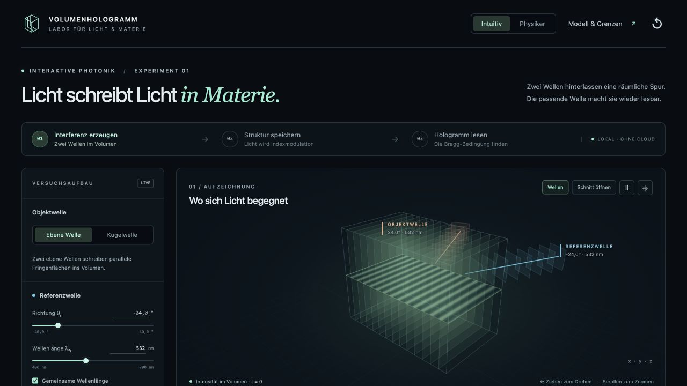

# Volumenhologramm-Labor – Licht schreibt Licht in Materie

Lokale interaktive Browser-Anwendung für Aufzeichnung, Volumengitter und Bragg-selektive Rekonstruktion. Keine externe API, keine Cloud, keine nachgeladenen Schriftarten oder Medien. Modell und numerische Rekonstruktion laufen im Browser; die Born-Rechnung in einem Web Worker.



## Herunterladen und starten

**Zum Ausprobieren:** Unter [Releases](https://github.com/Xindaan/volumenhologramm-labor/releases/latest) das fertige **`volumenhologramm-labor-v1.0.0.zip`** laden und vollständig entpacken. Benötigt werden nur **Python 3.9 oder neuer** und ein Browser mit WebGL 2.

- **Windows:** `Start-Windows.cmd` öffnen.
- **macOS:** `Start-macOS.command` öffnen; alternativ im Paketordner `python3 start.py` ausführen.
- **Linux:** im Paketordner `sh Start-Linux.sh` ausführen.

Der Starter öffnet den Browser auf **http://127.0.0.1:5197/**. Terminal offen lassen; Strg+C beendet den Server. Alle Dateien einschließlich `dist/` zusammenlassen. Die HTML-Datei allein reicht nicht aus. Nach dem Download und der Python-Installation funktioniert das Paket ohne Internetverbindung.

**[Vollständige Installationsanleitung und Hilfe bei Startproblemen](INSTALLATION.md)**

## Aus dem Quellcode entwickeln

Node.js 22.12 oder neuer mit npm; zum Klonen außerdem Git:

```bash
git clone https://github.com/Xindaan/volumenhologramm-labor.git
cd volumenhologramm-labor
npm ci
npm run dev
```

Öffnen: **http://127.0.0.1:5197/**. `npm ci` lädt die festgeschriebenen Abhängigkeiten. Der Server bindet ausschließlich an die lokale Loopback-Adresse. Port 5197 muss frei sein. Im Git-Repository sind `dist/` und `node_modules/` nicht enthalten; das Release-ZIP enthält bereits den fertigen Build.

```bash
npm test         # analytische und numerische Modelltests
npm run check   # Syntaxprüfung der Oberflächenmodule
npm run build   # vollständig lokales Produktionsbundle in dist/
npm run preview # Produktionsbundle auf Port 5197; vorher dev beenden
npm run package # Tests, Build und fertiges ZIP in artifacts/; benötigt python3
npm run test:package # entpacktes Paket, Startserver, Assets und Prüfsummen prüfen
```

Die fertige `dist/`-Anwendung kann auch von einem anderen lokalen HTTP-Server ausgeliefert werden. ES-Module und Worker benötigen HTTP; `file://` ist kein unterstützter Startweg.

## Ein Versuch in zwei Minuten

1. Im Ausgangszustand schneiden sich ebene Aufzeichnungswellen bei internen Winkeln −24° und +24°, λ₀ = 532 nm, n = 1,5. Das 40 µm dicke Volumen enthält Fringen mit Λ ≈ 0,436 µm.
2. Volumen durch Ziehen drehen, am Mausrad zoomen. Alternativ das fokussierte 3D-Canvas mit Pfeiltasten drehen. xz-, xy- oder yz-Schnitt wählen, verschieben und das Volumen am Schnitt öffnen.
3. **Struktur aufzeichnen**, dann **Hologramm lesen**. Die Objektwelle ist aus. Das gespeicherte Gitter rekonstruiert bei passender Beleuchtung die ebene Objektwelle.
4. Den internen Rekonstruktionswinkel auf −23° setzen: η fällt von 100 % auf etwa 6,2 %. Zahlenfelder akzeptieren Punkt oder Komma; Werte wirken sofort. **Aufzeichnungsgeometrie treffen** stellt den passenden Winkel und die passende Wellenlänge wieder her.
5. Auf 547 nm verstimmen: η ≈ 7,9 %. Mit **λ** den Spektralscan öffnen. Auch ein Klick in den Scan verstellt die Beleuchtung.
6. d auf 80 µm setzen und **ν = π/2 einstellen**: Die Spitzenkonversion bleibt bei 100 %, die Winkel-FWHM sinkt von etwa 0,499° auf 0,249°. Die gestrichelte Vergleichskurve hält ν konstant, indem sie d/4 und 4Δn verwendet.
7. **Physiker** ergänzt Vektoren, Phasenfehler, Kopplungsparameter und Gültigkeitsschranken. Es bleibt derselbe physikalische Zustand.

Für die Kugelwelle: zur Aufzeichnung zurückkehren, **Kugelwelle** wählen und den virtuellen Punkt einstellen. Die Demo stellt dabei einen kleinen Modulationsfaktor von 0,00030 ein. Nach erneutem Aufzeichnen/Lesen ersetzt ein **numerisch berechnetes komplexes Austrittsfeld** den ebenen Effizienzscan. Phase ist zyklische Farbe, Helligkeit der relative Feldbetrag. Winkel und Wellenlänge wirken auf das Volumenintegral. Die Born-Näherung berechnet keine transmittierte Restleistung.

Auf schmalen Bildschirmen öffnet **Parameter öffnen** die Einstellungen. Die Modelldokumentation ist über **Modell & Grenzen** bzw. am Seitenende über **Näherungen lesen** erreichbar.

## Aufzeichnung und Daten

Aufgezeichnet wird eine unabhängige Kopie der analytischen Feldparameter einschließlich Belichtungszeit, Dosis und Index. Das speichert die gesamte räumliche Funktion statt eines groben Voxelbildes. Änderungen an den Aufzeichnungswellen überschreiben diesen Snapshot erst bei erneuter Aufzeichnung. d und Δn bleiben bewusst als Parameterexperimente veränderbar.

Ein Snapshot wird zusätzlich unter einem anwendungsspezifischen Schlüssel in der lokalen Browserablage gespeichert und beim Neuladen wiederhergestellt. Im Speicherschritt kann er als JSON exportiert werden. Reset setzt den Versuch zurück und entfernt ausschließlich diesen Anwendungssnapshot. Es gibt keine Übertragung an einen Server.

## Physikalische Dokumentation und Abnahme

- [Modellgleichungen und Näherungen](docs/MODEL.md)
- [Testfälle, erwartete Resultate und Browserprüfung](docs/TESTS.md)
- Vollständige ausführbare Tests: [Modelltests im Quellcode](https://github.com/Xindaan/volumenhologramm-labor/blob/main/tests/model.test.mjs)
- Direkt in der Anwendung: **Modell & Grenzen**

Bewusst nicht enthalten: Materialchemie, reale Fertigung, Absorption, Dispersion, Fresnel-Grenzflächen, Reflexionshologramme, vollständige Maxwell-/RCWA-Rechnung und produktspezifische Verfahren.

## Aufbau des Quellcodes

| Datei | Aufgabe |
|---|---|
| `src/model.mjs` | Einheiten, komplexe Felder, Belichtungsmittelung, Snapshot, Zweiwellenmodell, Scans |
| `src/fft.mjs` | Vorwärts-/inverse komplexe FFT und 2D-Transformation |
| `src/born.mjs` | Selektierte Vorwärts-Born-Rekonstruktion mit endlicher Rechenapertur |
| `src/born-worker.js` | Numerik außerhalb des UI-Threads; alte Rechnungen werden abgebrochen |
| `src/volume.js` | WebGL-Raymarching, exakte ebene Phasenflächen, Schnitte, schematische Wellen |
| `src/charts.js` | Analytische Schnittansicht, Scans, Austrittsfeld und k-Diagramm |
| `src/main.js` | Gemeinsamer Modellzustand, Bedienelemente und lokale Speicherung |
| `src/documentation.js` | Vollständige eingebettete Modelldokumentation |
| `start.py`, `Start-*` | Lokaler HTTP-Server und Starter für das fertige Paket |
| `scripts/package_release.py` | Versioniertes ZIP mit Dateimanifest und SHA-256-Prüfsummen |
| `tests/test_distribution.py` | Prüfung des tatsächlich entpackten Weitergabepakets |

Abhängigkeiten: Three.js 0.180.0, Vite 7.1.5. Die Modelltests selbst nutzen ausschließlich Node.js-Bordmittel; Starter und Pakettests ausschließlich die Python-Standardbibliothek. Der Lizenzhinweis für das mitgelieferte Three.js liegt unter [public/THIRD_PARTY_NOTICES.txt](public/THIRD_PARTY_NOTICES.txt).

Das Release-ZIP enthält den Browser-Build, Starter, Anleitungen, Modelldokumentation, ein Vorschaubild und `SHA256SUMS.txt`. Zusätzlich wird eine Prüfsumme des gesamten ZIPs veröffentlicht. Für Änderungen am Modell oder an der Oberfläche den Quellcode aus diesem Repository verwenden.
